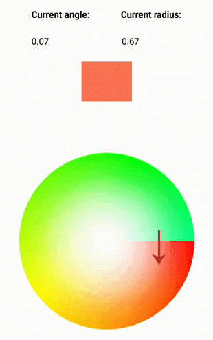

# PolarCircleShp
This library provides customasable and easy to use Custom View circle that operates with polar coordinates.
## About The Project
The library invokes provided callbacks with [polar coordinates](https://en.wikipedia.org/wiki/Polar_coordinate_system) of the touch event. You can use provided angle and radius of given point for your calculations.



## Example of usage
```sh
        CirclePolarBuilder<T, V>(  /* T is what calculation based on angle will return,  V is what calculation based on radius will return  */
            findViewById<SurfaceCircle>(R.id.SurfaceCircle), /* Custom view that you should place inside your xml file */
            Color.RED, /* Initial value derived from angle */
            0.6f /* Initial value derived from radius */
        )
            .addCalculatorValue {  /* Calculator returning T based on angle of user`s touch. Returns T */
                return T
            }
            .addReverseCalculatorValue { /* Reverse calculator for calculating angle based on provided initial value. Returns Float */
                return Float
            }
            .addCalculatorValueRadius {  /* Calculator returning V based on radius from center to user`s touch. Returns V */
                return V
            }
            .addReverseCalculatorValueRadius { /* Reverse calculator for calculating radius based on provided initial value. Returns Float */
                return Float
            }
            .addListenerCurrentValueAngle { t ->/* Callback that will be invoked by CalculatorValue. $it has type T*/

            }
            .addListenerCurrentValueRadius { v -> /* Callback that will be invoked by CalculatorValue. $it has type V*/

            }
            .addActionUpCallback { t, v -> /* Callback that will be invoked when MotionEvent.ACTION_UP is happens*/
                        
            }
            .addListenerBoth { t, v -> /* Callback that provides 2 values simultaneously. t has T type, v has V type*/

            }
            .setPointerResourceId(R.drawable.idPointer) /* Sets resource id for pointer */
            .setPointerDimensions(120, (100 * 1.2f).toInt()) /* Sets size for pointer drawable */
            .setCircleOutside(CircleDrawable()) /* Sets CircleDrawable object which has to implement draw()  */
            .build()
  ```
